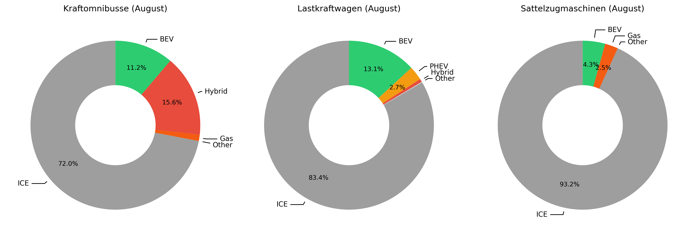
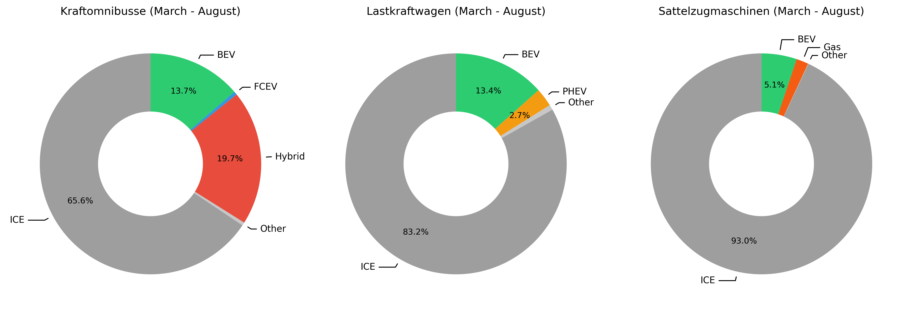
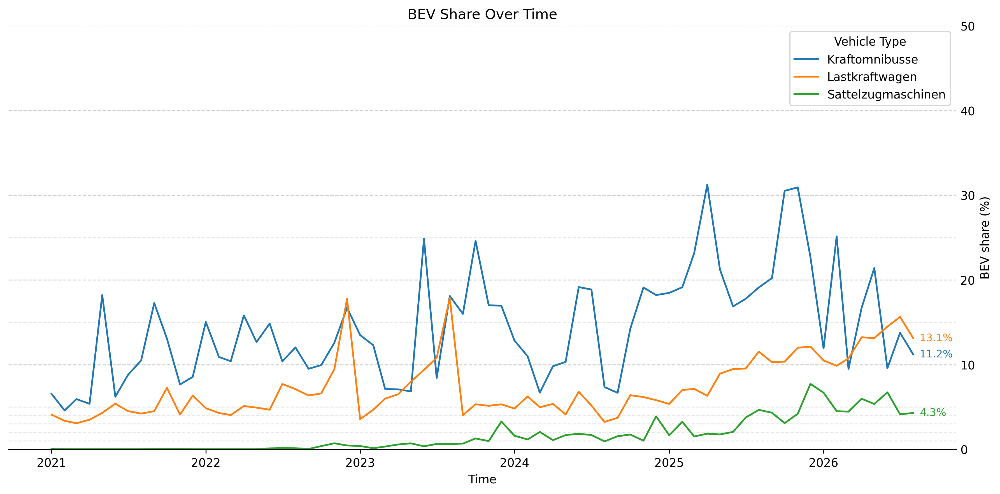
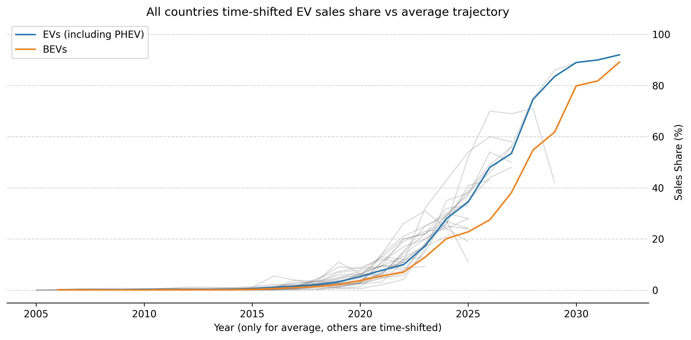

# Some data and simulations on the transition to EVs

This repo contains data, plots and simulated scenarios on the transition to EVs.  
All data should be automatically updated daily if everything works :)

Feel free to check out the different notebooks!

------

## [EV share by price in Germany](de_electric_passenger_by_price.ipynb)
This notebook prepares data on the share of electric car sales by price in Germany.

The results can be seen here:  
[Anteil Antriebsarten nach Listenpreis im August 2025 von 10 - 120k](https://www.datawrapper.de/_/PSqha/)

<iframe title="Anteil Antriebsarten nach Listenpreis im August 2025" aria-label="Scatterplot" id="datawrapper-chart-PSqha" src="https://datawrapper.dwcdn.net/PSqha/3/" scrolling="no" frameborder="0" style="width: 0; min-width: 100% !important; border: none;" height="805" data-external="1"></iframe>

------

## [EV development of the German trucking market](de_electric_truck_development.ipynb)
This notebook plots the data on the electrification of the heavy truck market in Germany, because I couldn't find anybody else doing it.
Data comes from the FZ 28 publication by the Kraftfahrtbundesamt:

Last month's registration numbers for large buses, trucks and tractor-trailers by fuel type:

The average over the last 6 months:

The development of the share of BEVs:

More plots can be found in the notebook.

------

## [Aligned global EV sales trajectories](world_ev_trajectories.ipynb)

The development of the sales share of EVs behaves similar in all countries, some are earlier and others later.  
Under this assumption, we can align all the trajectories by shifting them in time to arrive at an average trajectory for the transition to EVs:

The notebook also shows the individual countries' plots extended by the average trajectory.  
(Data currently comes from OWID / the IEA, so only the countries whose data you can see there show up here)

------

## Interesting Links and Dashboards

#### https://robbieandrew.github.io/carsales/
The global car sales dashboard by Robbie Andrew.  
Contains monthly sales data on many regions all plotted in a similar, easily comparable style.  
(Probably the most comprehensive collection of this data on the web)