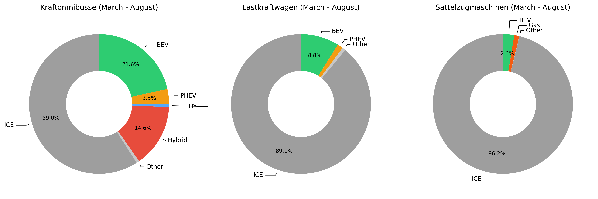
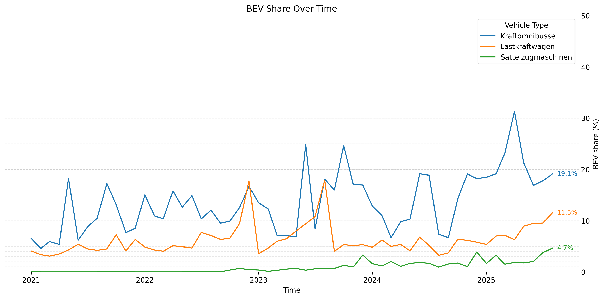

# Some data and simulations on the transition to EVs

This repo contains data, plots and simulated scenarios on the transition to EVs.  
All data should be automatically updated daily if everything works :)

Feel free to check out the different notebooks!

## [EV development of the German Trucking market](de_electric_truck_development.ipynb)
This notebook plots the data on the electrification of the heavy truck market in Germany, because I couldn't find anybody else doing it.
Data comes from the FZ 28 publication by the Kraftfahrtbundesamt:

Last month's registration numbers for large buses, trucks and tractor-trailers by fuel type:

The average over the last 6 months:

The development of the share of BEVs:

More plots can be found in the notebook.

## [Aligned global EV sales trajectories](world_ev_trajectories.ipynb)

The development of the sales share of EVs is similar in all countries.  
Under this assumption, we can align all the trajectories by shifting them in time to arrive at an average trajectory:

The notebook also shows the individual countries' plots extended by the average trajectory.

## Interesting Links and Dashboards

#### https://robbieandrew.github.io/carsales/
The global car sales dashboard by Robbie Andrew.  
Contains monthly sales data on many regions all plotted in a similar, easily comparable style